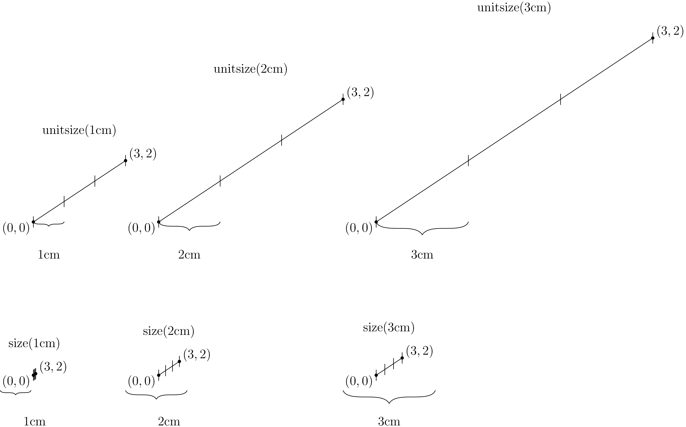

# Asymptote scaling demonstration.

There are two main ways to scale an Asymptote diagram:
* The `unitsize(real x)` command, which sets `1` Asymptote unit to be displayed at size `x` units.
* The `size(real x)` command, which sets the entire diagram to be displayed at size `x` units.

If `x` is a unitless number, then it is interpreted as PostScript big points (`bp`). Otherwise, it is interpreted with the given unit (`pt`, `cm`, `mm`, or `inches`).

For example, the following examples show a line drawn from `(0, 0)` to `(3, 2)` in Asymptote coordinates, and then scaled using the labelled function.

However, scaling does not affect stroke width, font size, and anything dependent thereupon, such as dot size. Hence, `size` will fail on a diagram that contains an unscalable object larger than the argument of `size`, such as a lengthy label or a massive dot. In this case, Asymptote will try its best.

For example, here is the same line from `(0, 0)` to `(3, 2)` drawn at smaller sizes. Whereas `unitsize(1cm)` and `unitsize(2cm)` happily succeed, `size(1cm)` and `size(2cm)` fail because the coordinate labels cannot be scaled down. The diagrams with `unitsize(3cm)` and `size(3cm)` both succeed as well; they are repeated here for comparison.

